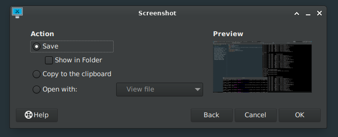
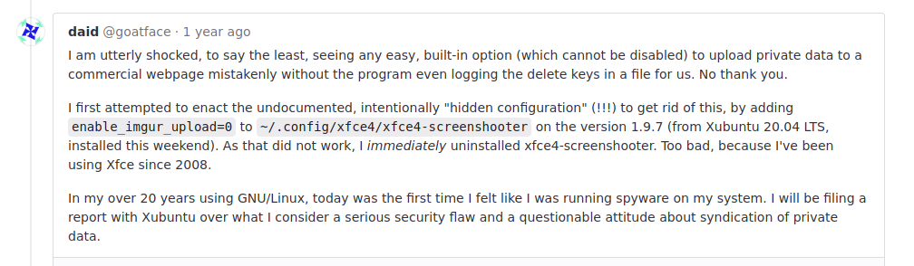

# xfce4-screenshooter without imgur

Xfce4-screenshooter allows you to capture the entire screen, the active
window or a selected region. You can set the delay that elapses
before the screenshot is taken and the action that will be done with
the screenshot: save it to a /PNG file, copy it to the clipboard, open
it using another application, ~~or host it on imgur.com,
a free online image hosting service~~.

##### Why? Because:

----

### Original homepage

[Xfce4-screenshooter documentation](https://docs.xfce.org/apps/xfce4-screenshooter/start)

### Original Source Code Repository

[Xfce4-screenshooter source code](https://gitlab.xfce.org/apps/xfce4-screenshooter)

### Installation

From source code repository: 

    % cd xfce4-screenshooter-without-imgur
    % ./autogen.sh
    % make
    % make install

### FreeBSD

##### Build dependencies

    % msgfmt : devel/gettext-tools
    % gmake>=4.3 : devel/gmake
    % intltool-extract : textproc/intltool
    % pkgconf>=1.3.0_1 : devel/pkgconf
    % ice.pc : x11/libICE
    % sm.pc : x11/libSM
    % x11.pc : x11/libX11
    % xfixes.pc : x11/libXfixes
    % xext.pc : x11/libXext

[Check out xfce4-screenshooter-plugin port for more dependencies information](https://www.freshports.org/x11/xfce4-screenshooter-plugin/)

##### Troubleshooting

    % In case there are any problems with a build try to delete `help2man` package
    % `make` output is pretty bad at showing where exectly the problem is so you can use `truss`
    % doas truss -f make
